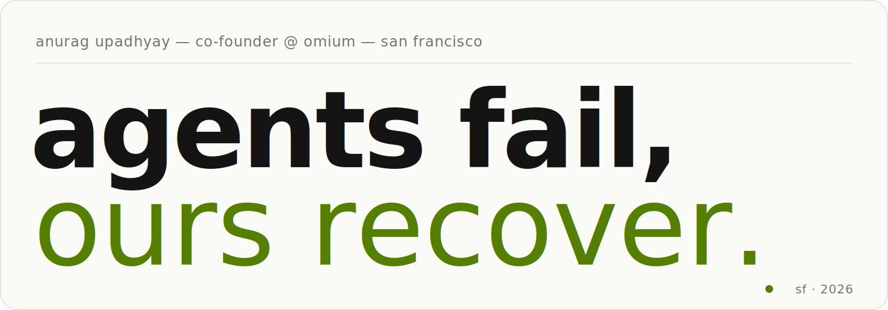
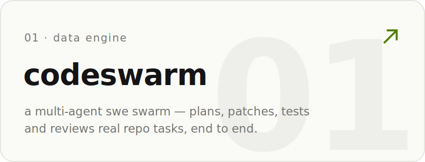
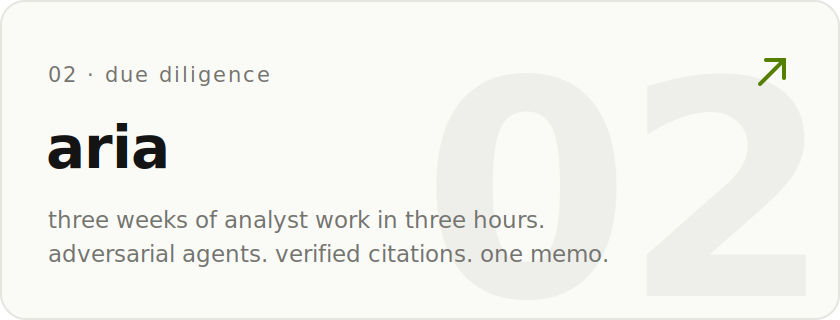
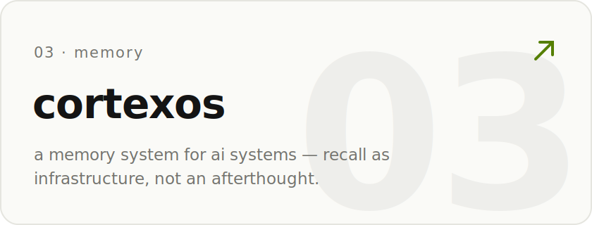
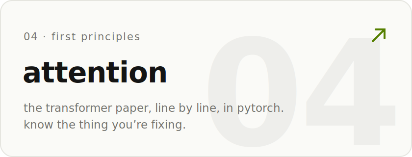
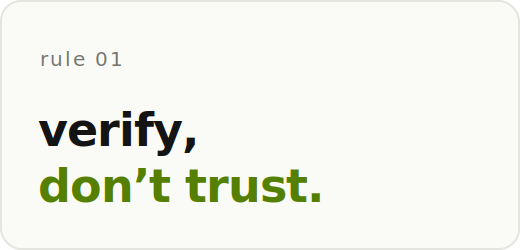
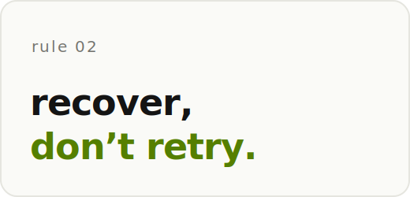
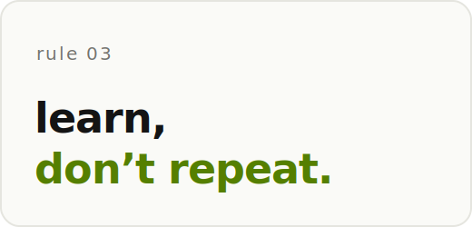
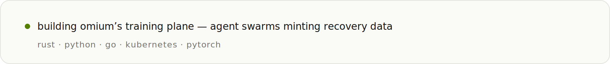
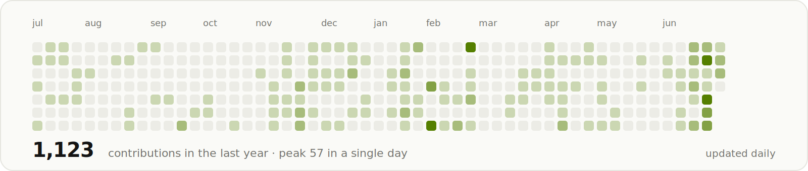

<!-- reading the source? rule 01: verify, don’t trust. -->
<a href="https://omium.ai"><picture><source media="(prefers-color-scheme: dark)" srcset="assets/v2/hero-dark.svg"></picture></a>

**co-founder @ [omium](https://omium.ai)** — self-healing infrastructure for ai agents.

most agent infra assumes the happy path. production isn't the happy path. omium runs agents, verifies the work is real, recovers the runs that break — and mints every failure into training data for the run after it.

<samp>SELECTED WORK</samp>

<a href="https://github.com/coderthroughout/codeswarm"><picture><source media="(prefers-color-scheme: dark)" srcset="assets/v2/codeswarm-dark.svg"></picture></a><a href="https://github.com/coderthroughout/Aria"><picture><source media="(prefers-color-scheme: dark)" srcset="assets/v2/aria-dark.svg"></picture></a><a href="https://github.com/coderthroughout/CortexOS"><picture><source media="(prefers-color-scheme: dark)" srcset="assets/v2/cortexos-dark.svg"></picture></a><a href="https://github.com/coderthroughout/Attention-Is-All-You-Need-Implementation"><picture><source media="(prefers-color-scheme: dark)" srcset="assets/v2/attention-dark.svg"></picture></a>

<samp>OPERATING PRINCIPLES</samp>

<picture><source media="(prefers-color-scheme: dark)" srcset="assets/v2/rule1-dark.svg"></picture><picture><source media="(prefers-color-scheme: dark)" srcset="assets/v2/rule2-dark.svg"></picture><picture><source media="(prefers-color-scheme: dark)" srcset="assets/v2/rule3-dark.svg"></picture>

<samp>NOW</samp>

<a href="https://omium.ai"><picture><source media="(prefers-color-scheme: dark)" srcset="assets/v2/now-dark.svg"></picture></a>

<samp>PROOF OF WORK</samp>

<picture><source media="(prefers-color-scheme: dark)" srcset="assets/v2/heatmap-dark.svg"></picture>

<!-- stats -->
**1,389** contributions in the last year — **88%** of it heads-down in omium’s private repos.
<!-- /stats -->

<samp><a href="https://omium.ai">omium.ai</a> · <a href="https://x.com/AgniSut">x</a> · <a href="https://www.linkedin.com/in/anurag-upadhyay-023584222/">linkedin</a></samp>

<samp>this page rebuilds itself every morning — <a href=".github/workflows/stats.yml">here’s how</a></samp>
