<div align="center">
  
</div>

<br/>

```console
$ whoami
anurag — co-founder & backend engineer @ Omium · San Francisco

$ cat /etc/motd
AI agents got very good at acting.
Nobody taught them what to do when they fail.
That is the layer I build.
```

<br/>

## Ω &nbsp;What I'm building

**[Omium](https://omium.ai)** — the execution layer that makes AI agents survivable in production.

Every agent framework demos beautifully on the happy path. Production is not the happy path.
Omium treats failure as a first-class citizen: agent runs are executed, verified, and — when they
break — **recovered automatically**, with every failure converted into knowledge that makes the
next run stronger.

- 🧠 &nbsp;**Recovery, not retries** — failures are diagnosed and resolved, not just re-run and prayed over
- ⚖️ &nbsp;**Verified execution** — multi-model consensus decides whether an agent's work actually counts
- 🔁 &nbsp;**A learning flywheel** — every failure an agent survives is minted into training signal

<br/>

## ⚡ Selected work

| | |
|---|---|
| **[codeswarm](https://github.com/coderthroughout/codeswarm)** | Multi-agent software-engineering swarm — specialized agents plan, patch, test, and review real repository tasks end-to-end, minting verifiable execution traces along the way. |
| **[Aria](https://github.com/coderthroughout/Aria)** | Multi-agent due-diligence system: does in 3 hours what an analyst team does in 3 weeks — adversarial debate between specialist agents, verified citations, investment-grade memo out. |
| **[CortexOS](https://github.com/coderthroughout/CortexOS)** | A memory system for AI systems — persistence and recall as infrastructure, not an afterthought. |
| **[Attention Is All You Need — from scratch](https://github.com/coderthroughout/Attention-Is-All-You-Need-Implementation)** | The transformer paper, implemented line-by-line in PyTorch. I don't use abstractions I couldn't rebuild. |

<br/>

## 📡 Find me

<p>
  <a href="https://omium.ai"></a>&nbsp;
  <a href="https://www.linkedin.com/in/anurag-upadhyay-023584222/"></a>&nbsp;
  <a href="https://x.com/AgniSut"></a>&nbsp;
  <a href="https://anuragkashyap.netlify.app"></a>
</p>

<br/>

<div align="center">
  <br/>
  <b><code>agents fail. ours recover.</code></b>
  <br/><br/>
  <sub>© you can't automate the economy on agents that fall over.</sub>
</div>

<!-- Ω -->
